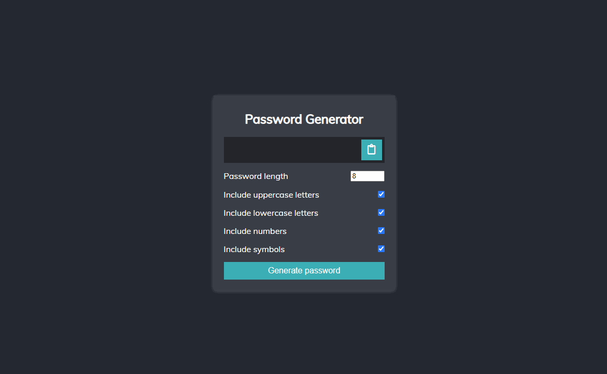

# JS Password Generator
A password generator made with Javascript, HTML and CSS

There are 4 different categories to select from: 
* Upper case letters
* Lower case letters
* Numbers 
* Symbols

Enter the amount (number) of characters you would like your password to be.

Tick the checkbox next to the categories you would like to include in the password and then click the Generate Password button.

Your password will appear. To copy it, simply click the copy button.
